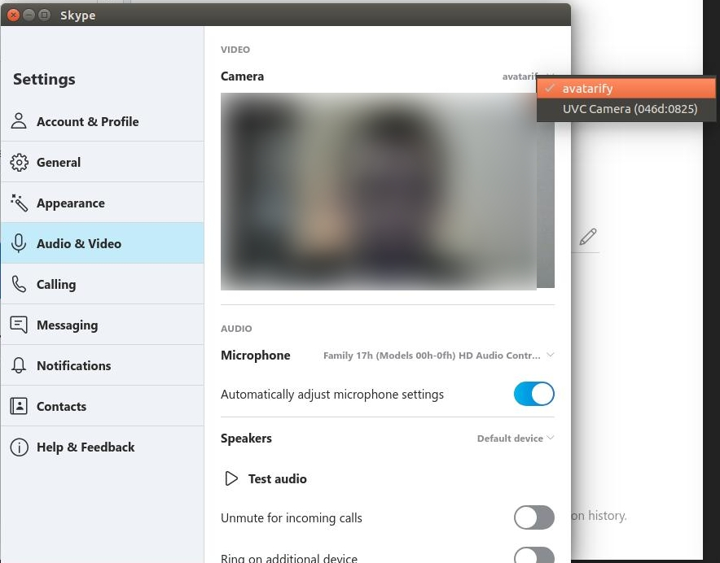
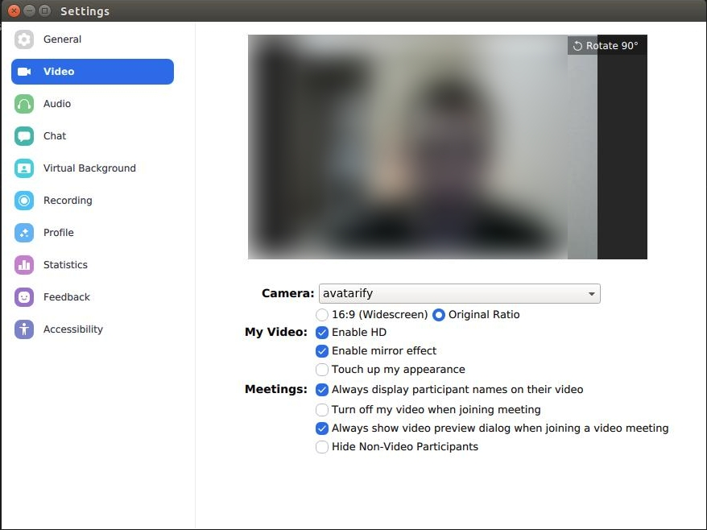
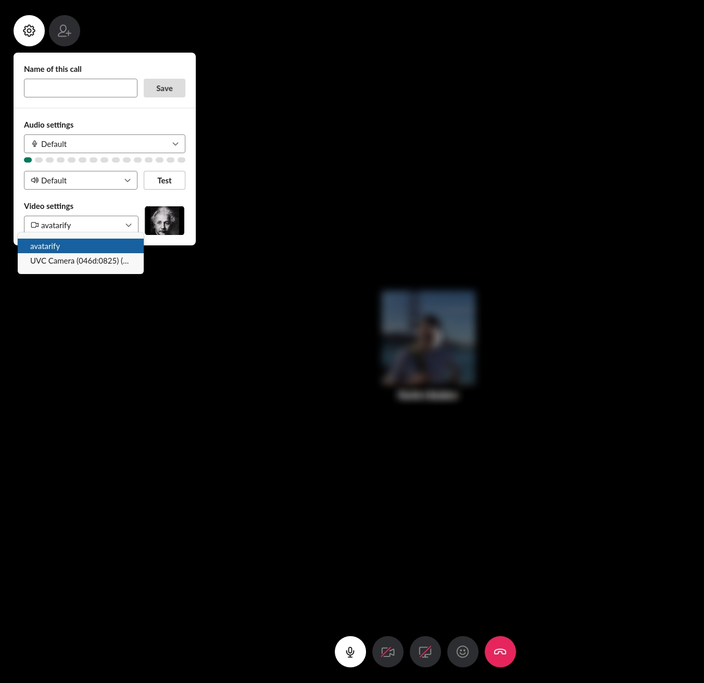

:arrow_forward: [Demo](https://youtu.be/Q7LFDT-FRzs) 

:arrow_forward: [AI-generated Elon Musk](https://youtu.be/lONuXGNqLO0)

# Avatarify

Avatars for Skype and Zoom. Democratized.

**Disclaimer**: This project is unrelated to Samsung AI Center.

## Requirements

* [conda](https://docs.conda.io/en/latest/miniconda.html)
* [CUDA](https://developer.nvidia.com/cuda-downloads)

## Performance:
- Linux (with 1080 Ti GPU): **33 fps**
- Mac OSX (MacBook Pro 2018; no GPU): **~1 fps**

## Install

#### Download
1. Download model's weights from [Google Drive](https://drive.google.com/file/d/1L8P-hpBhZi8Q_1vP2KlQ4N6dvlzpYBvZ/view) [716 MB]
2. Place `vox-adv-cpk.pth.tar` file in the root directory

#### Linux
It is supposed that there is only one web cam connected to the computer and it's in `/dev/video0`. Installation process will create a virtual camera `/dev/video9`, so this device must be reserved. You can change settings in `scripts/settings.sh`.

```bash
source scripts/install.sh
```

#### Mac
For Mac it's quite difficult to create a virtual camera, so we'll use [CamTwist](http://camtwiststudio.com) app:

1. Download and install [CamTwist](http://camtwiststudio.com) from [here](http://camtwiststudio.com/download). It's easy.
2. Setup `avatarify` conda environment with all required dependencies:
```bash
source scripts/install_mac.sh
```

## Setup avatars
Copy your avatars into `avatars` folder. Crop pictures to make them square. Prefer pictures with uniform background.

## Run
Your web cam must be plugged-in. You can choose your camera by changing `CAMID` in `scripts/settings.sh` script.

#### Linux
Run:
```bash
bash run.sh
```

#### Mac
1. Run:
```bash
bash run_mac.sh
```
2. Go to [CamTwist](http://camtwiststudio.com).
3. Choose `Desktop+` and press `Select`.
4. In the `Settings` section choose `Confine to Application Window` and select `python (avatarify)` from the drop-down menu.


## Tips

Your face should fit in the red rectagle: it should not fit perfectly, but don't get too close/far. After that, press any number from 0 to 9 on your keyboard and one of the avatars from `avatars` directory will appear.

Run Skype or Zoom only when Avatarify is running.

### Skype

Go to Settings -> Audio & Video, choose `avatarify` or `CamTwist` camera.



### Zoom

Go to Settings -> Video and choose `avatarify` or `CamTwist` from Camera drop-down menu.



### Slack

Make a call, allow browser using cameras, click on Settings icon, choose `avatarify` in Video settings drop-down menu.




## Contribution

Our goal is to democratize deepfake avatars. To make the technology even more accessible, we have to tackle two major problems:

1. Add support for more platforms (Linux and Mac are already supported).
2. Optimize neural network run-time. Running network real-time on CPU is of high priority.

Please make pull requests if you have any improvements or bug-fixes.


## Troubleshooting

* *Zoom/Skype doesn't see `avatarify` camera*. Restart Zoom/Skype and try again.
* *Avatar image is frozen*: In Zoom, try Stop and Start Video.
* *`bash run_mac.sh` crashes with "Cannot open camera"*: Try to change CAMID in `run_mac.sh` from `0` to `1` or `2`


## Credits

- Avatrify uses [First Order Motion Model](https://github.com/AliaksandrSiarohin/first-order-model) for generating avatars.
