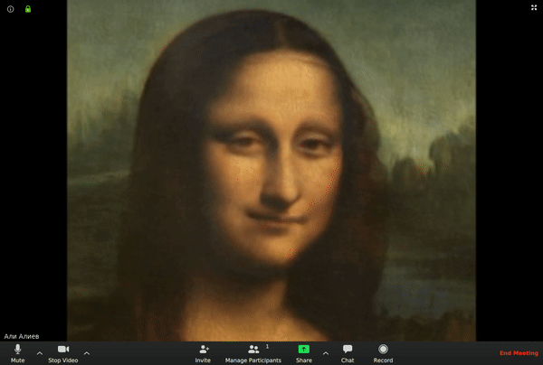

# Avatarify Python

Photorealistic avatars for video-conferencing.

Avatarify Python requires manually downloading and installing some dependencies, and is therefore best suited for users who have some experience with command line applications. [Avatarify Desktop](https://github.com/alievk/avatarify-desktop), which aims to be easier to install and use, is recommended for most users. If you still want to use Avatarify Python, proceed to the [install instructions](docs/).

Based on [First Order Motion Model](https://github.com/AliaksandrSiarohin/first-order-model).

**Avatarify Python is not affiliated with Avatarify Inc.**

## News
- **7 Mar 2021.** Renamed project to Avatarify Python to distinguish it from other versions of Avatarify
- **14 December 2020.** Released Avatarify Desktop. Check it out [here](https://github.com/alievk/avatarify-desktop).
- **11 July 2020.** Added Docker support. Now you can run Avatarify from Docker on [Linux](https://github.com/alievk/avatarify-python/blob/master/docs/README.md#docker). Thanks to [mikaelhg](https://github.com/mikaelhg) and [mintmaker](https://github.com/mintmaker) for contribution!
- **22 May 2020.** Added [Google Colab](https://colab.research.google.com/github/alievk/avatarify/blob/master/avatarify.ipynb) mode. Now you can run Avatarify on any computer without GPU!
- **7 May 2020.** Added remote GPU support for all platforms (based on [mynameisfiber's](https://github.com/mynameisfiber) solution). [Demo](https://youtu.be/3Dz_bUIPYFM). Deployment [instructions](https://github.com/alievk/avatarify-python/wiki/Remote-GPU). 
- **24 April 2020.** Added Windows installation [tutorial](https://www.youtube.com/watch?v=lym9ANVb120).
- **17 April 2020.** Created Slack community. Please join via [invitation link](https://join.slack.com/t/avatarify/shared_invite/zt-dyoqy8tc-~4U2ObQ6WoxuwSaWKKVOgg).
- **15 April 2020.** Added [StyleGAN-generated](https://www.thispersondoesnotexist.com) avatars. Just press `Q` and now you drive a person that never existed. Every time you push the button – new avatar is sampled.
- **13 April 2020.** Added Windows support (kudos to [9of9](https://github.com/9of9)).

